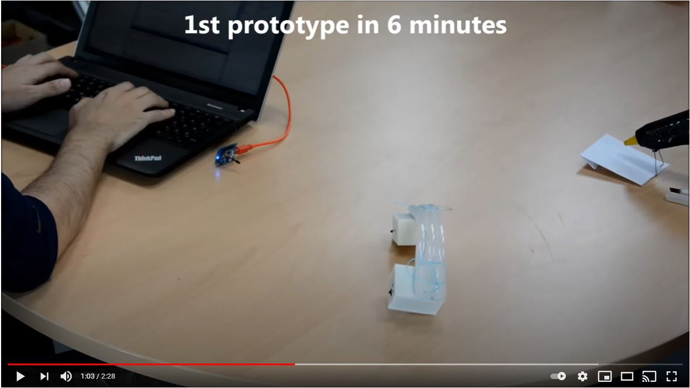

# Introduction to Hot Glue Robots

The main factor for building these robots is the usage of a smart material called hot melt adhesive (HMA) for the overall robot structure. A complete functional soft robot with custom shaped limbs and joints can be built by using this material. Due to its adhesiveness, a mix of materials and items can be glued together to make a "hybrid" robot. Therefore instead of giving design outlines on how to build a single robot with HMA, we will provide the material properties and examples of HMA usage in various robot construction. In this approach, we aim to emphasize the limitless potential for building robots and expect the users to come up with their robot designs.

# Kit 

This kit requires:

# Instructional Video

The following video details the fabrication process and how to get started with this activity.

# Activities
After following the video explore how you can:

* Design and build a robot to optimize for forward speed
* Explore xxxx

# Related research papers

To explore related concept in research, and where similar approaches have been used in research, read the following papers:

* 
*
